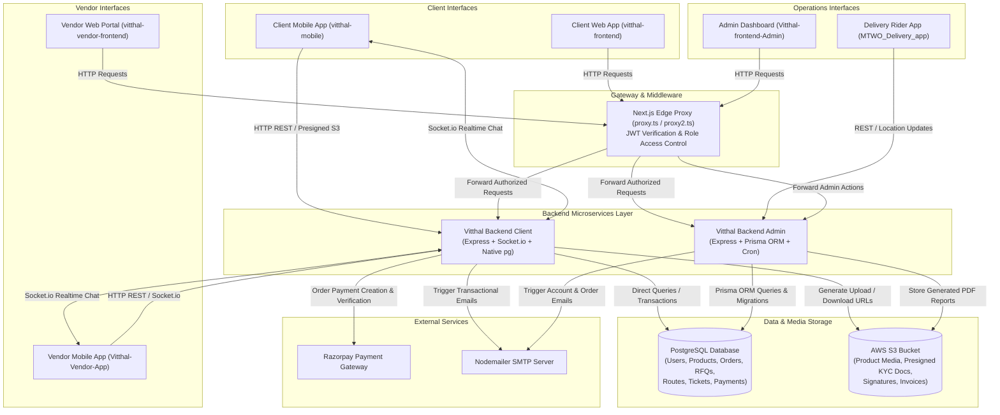
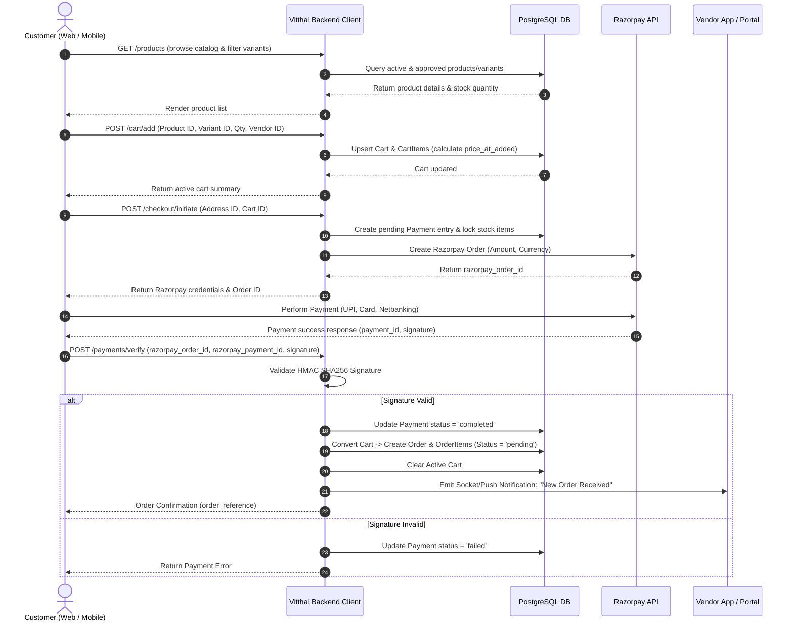
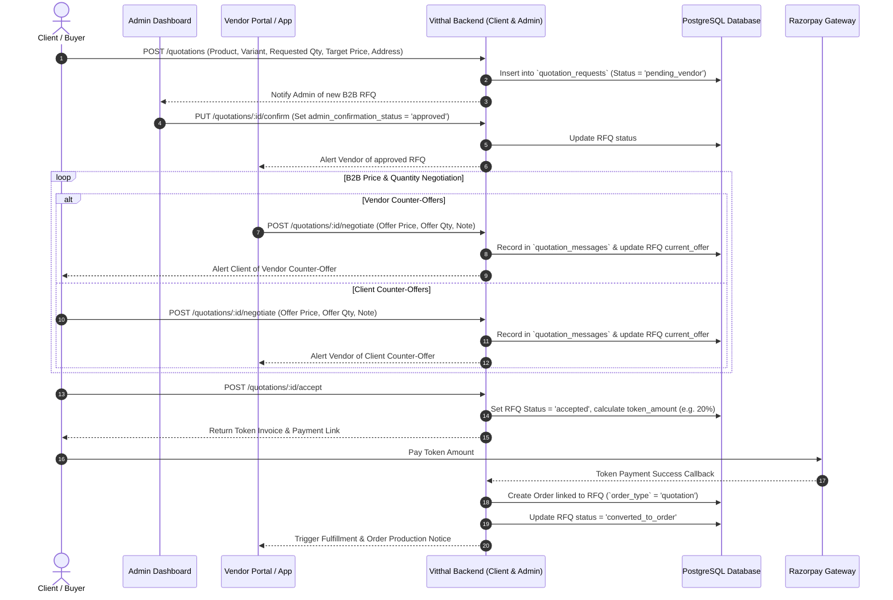
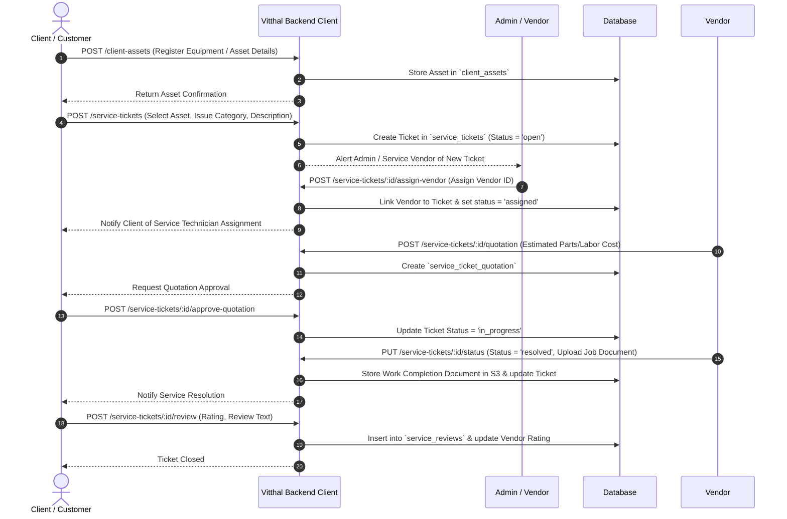
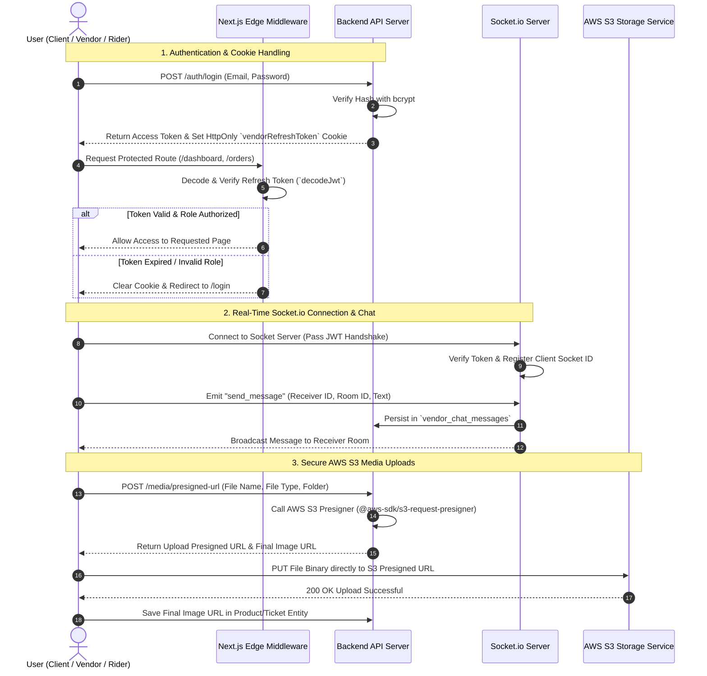

# Vitthal Project — Architecture, System Overview & Data Flow Diagrams

---

## 1. Executive Summary & About the Project

**Vitthal Project** is an enterprise-grade, multi-role digital ecosystem engineered for unified B2C/B2B E-Commerce, On-Demand Professional Services, Asset & Ticket Management, B2B Price Negotiation (RFQ), and End-to-End Logistics & Fulfillment.

The ecosystem connects four distinct primary stakeholders—**Clients (Customers)**, **Vendors**, **Delivery Agents (Riders)**, and **System Administrators / Fulfillment Center Managers**—across mobile apps, web dashboards, microservice-oriented backend APIs, and real-time messaging hubs.

```
┌─────────────────────────────────────────────────────────────────────────────────┐
│                               VITTHAL ECOSYSTEM                                 │
├───────────────┬────────────────┬──────────────────────┬─────────────────────────┤
│  Client Apps  │  Vendor Apps   │  Delivery Agent App  │       Admin Portal      │
│ (Web & Mobile)│ (Web & Mobile) │    (Mobile App)      │      (Web & Backend)    │
└───────┬───────┴───────┬────────┴──────────┬───────────┴────────────┬────────────┘
        │               │                   │                        │
        └───────────────┴─────────┬─────────┴────────────────────────┘
                                  ▼
                ┌──────────────────────────────────┐
                │  API Gateway & Security Proxies  │
                └─────────────────┬────────────────┘
                                  ▼
                ┌──────────────────────────────────┐
                │ Backend Microservices & Socket.io│
                └─────────────────┬────────────────┘
                                  ▼
                ┌──────────────────────────────────┐
                │ PostgreSQL DB & AWS S3 Storage   │
                └──────────────────────────────────┘
```

### Core Business Pillars & Modules

1. **B2C & B2B Product E-Commerce**:
   - Multi-vendor product catalog with categories, subcategories, variants, specifications, and SKU tracking.
   - Dynamic carts, wishlist, coupon/commission engine, inventory tracking, and split payment handling.

2. **On-Demand Services & Ticket Management**:
   - Booking of professional services (installation, maintenance, ritual/puja services, on-site assistance).
   - Ticket management pipeline allowing clients to register assets, open service tickets, request vendor quotations, track ticket statuses, and submit verified reviews.

3. **B2B RFQ & Negotiation Engine**:
   - Custom bulk purchasing workflows where clients issue Requests for Quotation (RFQ).
   - Integrated negotiation system allowing clients, admins, and vendors to submit counter-offers, adjust minimum order quantities (MOQ), issue token payment invoices, and convert agreed quotes into binding orders.

4. **Multi-Stop Logistics & Fulfillment**:
   - Route planning module (`order_route_plan`) calculating delivery sequences across multiple Fulfillment Centers.
   - Dispatching system assigning riders (`delivery_agents`) based on geographic proximity, active load, and vehicle type.
   - Dual OTP and QR Code security verification for item Pickups and Final Deliveries.

5. **Financial Operations & Settlements**:
   - Integrated Razorpay Payment Gateway supporting full payments, split payments, and token deposits.
   - Automated financial split engine generating rider earnings and vendor payouts after order fulfillment.

---

## 2. Technology Stack & Subsystems Overview

The codebase consists of **8 interconnected modules**:

| Module Directory | Type | Primary Tech Stack | Primary Responsibilities |
| :--- | :--- | :--- | :--- |
| `vitthal-mobile` | Mobile App | React Native (Expo), TypeScript, React Navigation, TanStack Query, Zustand | Customer Mobile Experience: Product discovery, service booking, ticket management, cart, live tracking, order history. |
| `vitthal-frontend` | Web App | Next.js, React, Tailwind CSS / Vanilla CSS | Customer Web Portal: Responsive e-commerce frontend, service booking portal, account management. |
| `Vitthal-Vendor-App` | Mobile App | React Native (Expo), TypeScript | Vendor Mobile Application: Real-time order alerts, RFQ negotiations, inventory updates, mobile order processing. |
| `vitthal-vendor-frontend` | Web Dashboard | Next.js, React | Vendor Web Portal: Comprehensive catalog management, B2B quotation desk, order fulfillment dashboard, payout reports. |
| `MTWO_Delivery_app` | Mobile App | React Native (Expo), Expo Location | Delivery Rider Mobile App: Order assignment alerts, navigation, pickup/delivery OTP/QR scanning, earnings ledger. |
| `Vitthal-frontend-Admin` | Web Dashboard | Next.js, React | Super Admin & Manager Portal: Platform governance, vendor approvals, product approval workflows, route plan monitoring, financial reports. |
| `Vitthal Backend Client` | Backend API | Node.js, Express.js 5.x, TypeScript, Native `pg`, Socket.io, Razorpay, S3 Presigner | Client & Socket Server: Customer API endpoints, cart handling, direct checkout, real-time chat, S3 presigned URL generation. |
| `Vitthal-Backend-Admin` | Backend API | Node.js, Express.js 5.x, Prisma ORM, Node-Cron, PDFMake | Admin & Operations Service: Database migration hub, admin governance endpoints, route planning engine, payout calculation, PDF generation. |
| `proxy.ts` / `proxy2.ts` | Edge Middleware | Next.js Middleware, JWT Decoder | Authentication Guard: Token validation, role-based route protection (`vendor`, `admin`, `super_admin`), cookie handling. |

---

## 3. Comprehensive Data Flow Charts

### Chart 1: System-Wide Architecture & Data Flow

This chart illustrates how data flows between user interfaces, gateway proxies, microservice backends, the database, and third-party integrations.



---

### Chart 2: Customer B2C Shopping, Cart & Order Checkout Flow

Shows the exact flow from product selection to payment verification and order status creation.



---

### Chart 3: B2B RFQ (Request For Quotation) & Price Negotiation Flow

Illustrates how custom bulk orders undergo negotiation between the Client, Admin, and Vendor before turning into a confirmed payment order.



---

### Chart 4: Multi-Stop Logistics, Route Planning & Delivery Agent Flow

Details how approved orders are routed through fulfillment centers, assigned to delivery agents, verified via OTP/QR codes, and settled upon delivery.

```mermaid
flowchart TD
    Start([Order Created & Verified]) --> RoutePlan[Admin / Backend Route Planner Engine]
    
    RoutePlan --> GenStops[Generate Route Plan in `order_route_plan`\nSequence: Vendor Pickup -> Fulfillment Center -> Customer Delivery]
    GenStops --> AssignFC[Assign Nearest Fulfillment Center]
    
    AssignFC --> FindRider[Scan Available Online Riders in `delivery_agents`\nMatching Vehicle Type & Location]
    FindRider --> AssignRider[Set `pickup_rider_id` & Emit Task Notification to Delivery App]
    
    AssignRider --> RiderAccept{Rider Accepts Job?}
    RiderAccept -- No --> FindRider
    RiderAccept -- Yes --> RiderToVendor[Rider Travels to Vendor Pickup Location]
    
    RiderToVendor --> PickupVerification{Pickup Verification}
    PickupVerification -->|Rider Scans Vendor QR Code OR Inputs Vendor Pickup OTP| VendorOTPCheck[Backend Validates `pickup_otp` / `pickup_qr_token`]
    
    VendorOTPCheck -- Valid --> StatusPickup[Update Order Status = 'picked_up'\nRecord Event in `order_fulfillment_tracking`]
    
    StatusPickup --> TransitToFC[Rider Delivers Package to Fulfillment Center]
    TransitToFC --> HubInward[Fulfillment Center Scan & Inward Processing]
    
    HubInward --> DispatchLastMile[Assign Last-Mile Delivery Rider]
    DispatchLastMile --> TransitToCustomer[Rider Travels to Customer Address]
    
    TransitToCustomer --> CustomerVerification{Delivery Verification}
    CustomerVerification -->|Customer Shares Delivery OTP OR Scans Rider QR| CustomerOTPCheck[Backend Validates `delivery_otp` / `delivery_qr_token`]
    
    CustomerOTPCheck -- Valid --> StatusDelivered[Update Order Status = 'delivered'\nMark Tracking Complete]
    
    StatusDelivered --> FinancialSettlement[Calc Rider Earnings in `rider_earnings`\nCalc Vendor Payout in `vendor_payouts`]
    FinancialSettlement --> End([Order Fulfillment Completed])
```



---

### Chart 5: On-Demand Service & Ticket Lifecycle Data Flow

Shows how clients log service tickets or asset requests, how vendors are assigned, and how services are fulfilled and reviewed.



---

### Chart 6: Authentication, Real-Time Socket Messaging & File Storage Flow

Illustrates secure user sessions via JWT refresh rotation, WebSocket real-time chat, and AWS S3 direct upload presigning.



---

## 4. Key Summary Table of Database Entities

| Entity / Table Name | Primary Role in Ecosystem | Key Relational Foreign Keys |
| :--- | :--- | :--- |
| `users` | Master accounts for Clients, Vendors, Delivery Agents, Admins. | Base user record linked to `client`, `vendors`, `delivery_agents`. |
| `products` / `product_variants` | Product catalog items and customizable variants. | `category`, `subcategory_id`, `created_by_user_id`. |
| `vendor_products` | Vendor-specific stock levels, pricing, MOQ, and quotation triggers. | `product_id`, `product_variant_id`, `vendor_id`. |
| `carts` / `cart_items` | Shopping basket for direct product & service purchases. | `user_id`, `product_variant_id`, `vendor_id`. |
| `orders` / `order_items` | Finalized binding orders (direct sales or converted RFQs). | `user_id`, `vendor_id`, `cart_id`. |
| `quotation_requests` | B2B negotiation requests (RFQ) with custom pricing & token terms. | `user_id`, `vendor_id`, `product_id`, `order_id`. |
| `order_route_plan` | Multi-stop transit legs connecting vendors, FC hubs, and riders. | `order_id`, `fulfillment_center_id`, `pickup_rider_id`. |
| `delivery_agents` | Rider profiles, vehicle registration, KYC status, push tokens, live GPS. | `user_id`, `fulfillment_center_id`. |
| `service_tickets` | Customer maintenance and support tickets. | `client_user_id`, `assigned_vendor_id`, `asset_id`. |
| `payments` | Razorpay transactions, token splits, and payment verification records. | `user_id`, `quotation_request_id`, `order_ids`. |

---
*Document generated for Vitthal Project Architecture & Workflow Documentation.*
